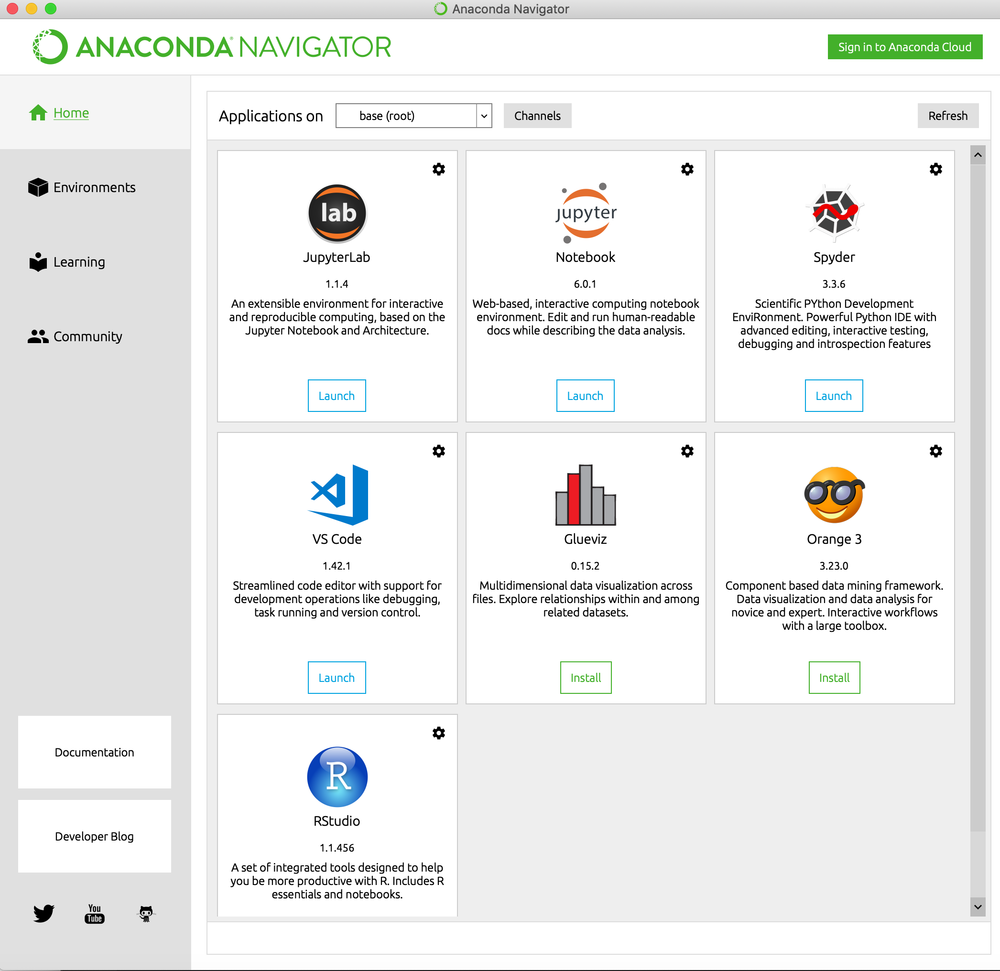
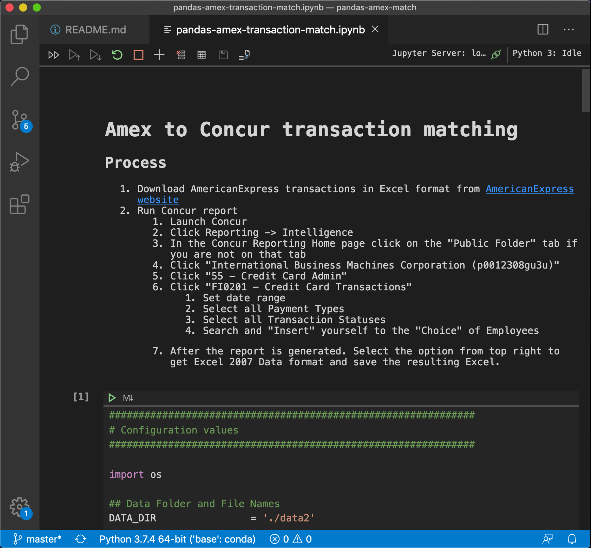
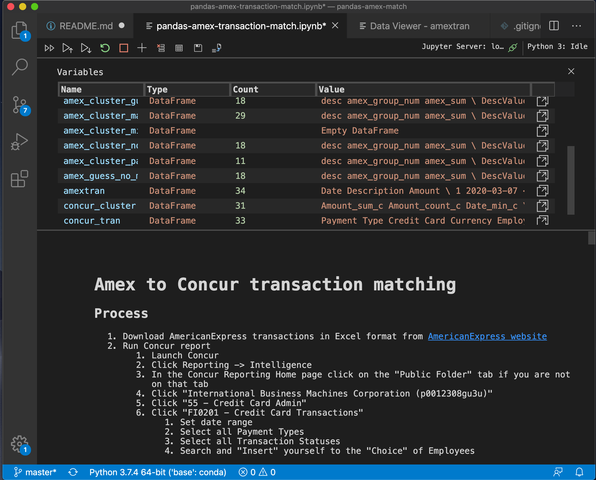

# pandas-amex-match

**Use data science to match your Amex transactions with Concur transactions.**

You heard all the buzz about Data Science and things like Python, Pandas, Numpy...
You have a suspicion about your corporate card. Is IBM really paying all the Amex charges?

Now, you can learn Data Science and catch any missed Amex charges. 

## Get Started

The project uses the following technologies:

- [Python](https://www.python.org)
- [Pandas](https://pandas.pydata.org/docs/)
- [Jupyter Notebook](https://jupyter.org)

### Environment

The easiest way is through [anaconda](https://www.anaconda.com/). Anaconda installs an isolated Python and Data Science package on your computer and doesn't change your existing Python or its path. You don't need to install anything other than Anaconda for this project.

You can use Anaconda Navigator once you finish the installation.

You can edit and run this project in JupyterLab, jupyter Notebook, and VS Code. The rest document uses VS Code since the author is too old to correct his deep rooted bias for an *"IDE editor"*. 

### Code and test like a Data Scientist

Once you open an ipynb file, VS Code automatically starts a Jupyter server and renders the Markdown cells and ML cells. Markdown cells and ML cells are just fancy words for documentation and executable codes fragments.

You can see the first cell is a documentation. If you double click on it, you can edit it in Markdown syntax.

The second cell is a python cell. You can update some of the "constant" variables in there. Constant is in quote because python doesn't believe in constant.

Once you wrote some code, you should test. VS Code provides the following run mode:

1. Run all cells
1. Run cells above
1. Run this cell and below

I find "Run cells above" is helpful in coding and testing. The "Show variables active in Jupyter kernel" is useful in seeing both scale values as well as Pandas dataframes as tables. 

